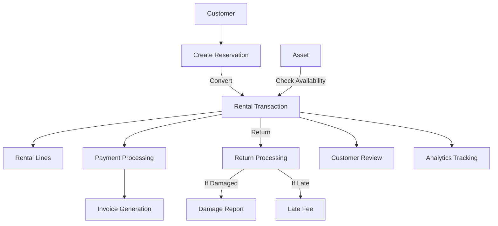

# Rental Business Management Platform - Master Project Documentation

## 🎯 Project Vision

A **multi-tenant SaaS platform** that enables businesses to manage rental operations end-to-end. The platform is designed to serve diverse rental industries including:
- Equipment rental
- Vehicle rental (cars, bikes, boats)
- Party/event equipment
- Clothing/costume rental
- Electronics rental
- Tools and machinery rental
- And any other rental business model

## 🏢 Business Model

### Multi-Tenant SaaS Architecture
Each **Business** (tenant) operates independently with:
- Complete data isolation
- Custom branding (logo, colors, domain)
- Subscription-based pricing (Plans)
- Multiple stores/locations
- Own employees (Users) and customers
- Custom business rules and policies

### Target Customers
- Small to medium rental businesses
- Enterprise rental chains
- Startups entering rental market
- Traditional businesses moving to digital

## 📊 Current Implementation Status

### ✅ Phase 1: Authentication & Multi-Tenancy (COMPLETED)

**What's Built:**
- Multi-tenant authentication system
- JWT-based security
- Role-based access control (RBAC)
- User management for employees
- Tenant (Business) registration and isolation

**Current Entities:**
- Tenant (needs renaming to Business)
- User (employee accounts)
- Role (SUPER_ADMIN, TENANT_ADMIN, MANAGER, USER)
- Permission (granular access control)

**API Endpoints:**
```
POST   /api/auth/tenant/register    - Register new business
POST   /api/auth/register            - Register employee
POST   /api/auth/login               - Login
GET    /api/user/me                  - Get current user
GET    /api/user/profile             - Get user profile
```

**Documentation:**
- AUTHENTICATION_README.md
- QUICK_START.md
- ARCHITECTURE.md
- IMPLEMENTATION_SUMMARY.md

### 🚧 What Needs to Be Built

The following sections detail the complete implementation roadmap based on the ER diagram.

---

## 🗺️ Complete System Architecture

### Entity Relationship Overview

```
Business (Tenant)
├── Subscription/Plan (SaaS billing)
├── Users (Employees)
├── Customers (People who rent)
├── Stores (Physical locations)
├── Assets (Rental inventory)
│   ├── AssetCategory
│   ├── AssetAvailability
│   ├── PricingRule
│   └── MaintenanceLog
├── RentalTransactions (Core business process)
│   ├── RentalLine (items in rental)
│   ├── Payment
│   ├── Return
│   ├── LateFee
│   ├── Invoice
│   └── DamageReport
├── PromoCode (Marketing)
├── Reservation (Pre-booking)
├── Review (Customer feedback)
├── Notification (Communication)
└── RentalAnalytics (Business intelligence)
```

### Data Flow: Core Rental Process



---

## 📋 Implementation Roadmap

### Phase 2: Core Entities & Master Data (Priority 1)

#### 2.1 Refactor Authentication to Match ER Diagram

**Tasks:**
1. Rename `Tenant` entity to `Business`
2. Update `User` entity to match ER schema
3. Separate `Customer` from `User` (critical distinction)
4. Update all repositories, services, and controllers
5. Update database migration scripts
6. Update documentation

**User vs Customer:**
- **User**: Employees of the business (clerks, managers, admins)
- **Customer**: People who rent from the business

#### 2.2 Business & Subscription Management

**Entities to Create:**
- `Plan` - Subscription plans (features, pricing, limits)
- `Subscription` - Business subscription to a plan
- Update `Business` entity with all fields from ER diagram

**Business Entity Fields:**
```java
- UUID id
- String businessName
- String businessType (equipment, vehicles, clothing, etc.)
- String contactPerson
- String phone, email, address
- String timezone, currency
- BigDecimal taxRate
- JSON lateFeePolicy
- JSON cancellationPolicy
- JSON businessHours
- String logoUrl
- String primaryColor, secondaryColor
- String customDomain
- Boolean onboardingCompleted
- Timestamps
```

**Key Features:**
- Business registration and onboarding
- Subscription plan selection
- Billing and invoicing
- Plan feature restrictions (max users, assets, stores)
- Business settings and customization

#### 2.3 Store Management

**Entity: Store**
```java
- UUID id
- UUID businessId (FK)
- String name
- String location
- String phone, email
- Text address
- JSON operatingHours
- String status (active, inactive)
- Timestamps
```

**Features:**
- Multi-location support
- Store-specific inventory
- Store assignment for employees
- Operating hours management
- Store performance tracking

#### 2.4 Customer Management

**Entity: Customer**
```java
- UUID id
- UUID businessId (FK)
- String name
- String email, phone
- String customerType (individual, business)
- String companyName, taxId
- Text address
- String emergencyContactName, emergencyContactPhone
- BigDecimal creditLimit
- BigDecimal outstandingBalance
- BigDecimal rating
- String idVerificationStatus
- String idDocumentUrl
- Boolean blocked
- Text blockedReason
- String blacklistStatus
- Boolean dataConsent, marketingConsent
- Timestamps
```

**Features:**
- Customer registration and profiles
- ID verification
- Credit limit management
- Customer rating system
- Blacklist/block management
- Outstanding balance tracking
- GDPR compliance (data consent)

#### 2.5 Asset Management

**Entities:**
- `AssetCategory` - Asset categorization
- `Asset` - Rental items/equipment
- `AssetAvailability` - Date-based availability calendar
- `PricingRule` - Dynamic pricing
- `MaintenanceLog` - Asset maintenance tracking

**Asset Entity:**
```java
- UUID id
- UUID businessId, storeId, categoryId (FKs)
- String name
- String serialNumber (unique tracking)
- Text description
- BigDecimal rentalPrice
- Integer quantityTotal, quantityAvailable
- Integer minRentalPeriod, maxRentalPeriod
- LocalDate purchaseDate
- BigDecimal purchasePrice
- BigDecimal depreciationRate, currentValue
- String condition (new, good, fair, poor)
- String status (available, rented, maintenance, retired)
- JSON specifications
- JSON imageUrls
- JSON metadata
- Soft delete support
- Audit fields (createdBy, updatedBy)
- Timestamps
```

**Features:**
- Asset catalog management
- Multi-image support
- Serial number tracking
- Quantity/inventory management
- Asset condition tracking
- Depreciation calculation
- Availability calendar
- Category-based organization
- Store assignment
- Search and filtering

**PricingRule Entity:**
```java
- UUID id
- UUID businessId, assetId, categoryId (FKs)
- Integer durationFrom, durationTo (in days)
- BigDecimal discountPercentage
- BigDecimal seasonalMultiplier
- Date validFrom, validUntil
- Boolean active
```

**Pricing Features:**
- Duration-based pricing (longer rental = discount)
- Seasonal pricing (peak/off-peak)
- Category-level or asset-specific rules
- Dynamic price calculation
- Bulk rental discounts

---

### Phase 3: Rental Operations (Priority 1)

#### 3.1 Core Rental Flow

**Entities:**
- `Reservation` - Pre-booking system
- `RentalTransaction` - Main rental record
- `RentalLine` - Items in rental (cart)
- `Payment` - Payment processing
- `Invoice` - Invoice generation
- `Return` - Return processing
- `LateFee` - Late fee calculation
- `DamageReport` - Damage tracking

**RentalTransaction Entity:**
```java
- UUID id
- UUID businessId, customerId, storeId, clerkId, promoCodeId (FKs)
- String rentalType (walk-in, delivery, pickup)
- Timestamp rentalDate, dueDate
- Integer rentalDuration
- String pickupMethod (customer_pickup, delivery, courier)
- JSON deliveryAddress
- BigDecimal deliveryFee
- BigDecimal subtotal, discountAmount, taxAmount
- BigDecimal lateFee, damageFee, securityDeposit
- Boolean depositReturned
- BigDecimal totalAmount, paymentAmount
- String status (pending, active, returned, cancelled)
- Timestamp pickupTime, actualReturnTime
- String expectedCondition, actualCondition
- Text notes
- String signatureUrl
- String contractPdfUrl
- Audit fields
- Timestamps
```

**Rental Flow:**
1. Customer browses assets
2. Checks availability
3. Creates reservation (optional)
4. Converts to rental transaction
5. Selects rental items (RentalLine)
6. Applies promo code (optional)
7. Calculates pricing with rules
8. Processes payment
9. Generates invoice and contract
10. Asset pickup/delivery
11. Return processing
12. Damage inspection
13. Late fee calculation
14. Final settlement
15. Customer review

**Key Features:**
- Reservation system with calendar
- Real-time availability checking
- Shopping cart functionality
- Dynamic pricing calculation
- Multiple payment methods
- Partial payments
- Security deposit handling
- Contract generation (PDF)
- Digital signature capture
- Delivery scheduling
- Pickup notifications
- Return reminders
- Late fee automation
- Damage assessment
- Refund processing

#### 3.2 Payment Processing

**Payment Entity:**
```java
- UUID id
- UUID invoiceId, rentalTransactionId (FKs)
- String paymentType (rental, deposit, damage, late_fee)
- BigDecimal amount
- String method (cash, card, bank_transfer, online)
- String paymentGateway (stripe, paypal, square)
- String transactionId
- String status (pending, completed, failed, refunded)
- BigDecimal refundAmount
- LocalDate refundDate
- String receiptUrl
- Timestamp createdAt
```

**Features:**
- Multiple payment methods
- Payment gateway integration (Stripe, PayPal)
- Partial payment support
- Payment history
- Receipt generation
- Refund processing
- Payment reminders
- Failed payment handling

#### 3.3 Return & Damage Management

**Return Entity:**
```java
- UUID id
- UUID rentalTransactionId, assetId (FKs)
- Timestamp returnDate
- String conditionOnReturn
- Text damageNotes
- BigDecimal damageCharge
- Boolean lateReturn
- Integer daysLate
- BigDecimal lateFee
- String status (completed, disputed)
```

**DamageReport Entity:**
```java
- UUID id
- UUID assetId, rentalTransactionId, reportedBy (FKs)
- String damageType (minor, major, total_loss)
- Text description
- BigDecimal estimatedRepairCost
- BigDecimal actualRepairCost
- String repairStatus (pending, in_progress, completed)
- JSON images
- Timestamps
```

**Features:**
- Return checklist
- Condition inspection with photos
- Damage assessment and charging
- Late return detection and fee calculation
- Automated late fee calculation
- Dispute management
- Asset condition history
- Repair cost tracking

---

### Phase 4: Marketing & Customer Engagement (Priority 2)

#### 4.1 Promo Code System

**Entity: PromoCode**
```java
- UUID id
- UUID businessId (FK)
- String code (unique)
- String discountType (percentage, fixed_amount)
- BigDecimal discountValue
- BigDecimal minRentalAmount
- Integer maxUses, usedCount
- Timestamp validFrom, validUntil
- Boolean active
```

**Features:**
- Promo code creation
- Usage limits
- Expiration dates
- Minimum order value
- Usage tracking
- Code validation
- Analytics per code

#### 4.2 Review & Rating System

**Entity: Review**
```java
- UUID id
- UUID businessId, assetId, customerId, rentalTransactionId (FKs)
- Integer rating (1-5)
- Text comment
- Boolean approved (moderation)
- Timestamp createdAt
```

**Features:**
- Customer reviews after rental
- Asset rating aggregation
- Review moderation
- Response to reviews
- Review analytics
- Display on asset listings

#### 4.3 Notification System

**Entity: Notification**
```java
- UUID id
- UUID userId, customerId (FKs)
- String type (email, sms, push, in-app)
- String title
- Text message
- Boolean read
- JSON metadata
- Timestamp createdAt
```

**Notification Types:**
- Reservation confirmation
- Rental reminder (pickup)
- Return reminder (due date approaching)
- Overdue alert
- Payment confirmation
- Payment reminder
- Damage report notification
- Maintenance alert
- Promotional messages

**Features:**
- Multi-channel notifications (email, SMS, push)
- Template management
- Scheduled notifications
- Read/unread tracking
- Notification preferences
- Bulk notifications

---

### Phase 5: Analytics & Reporting (Priority 2)

#### 5.1 Business Intelligence

**Entity: RentalAnalytics**
```java
- UUID id
- UUID businessId (FK)
- Date date
- Integer totalRentals
- BigDecimal totalRevenue
- BigDecimal utilizationRate
- JSON popularAssets
- JSON customerSegments
- Timestamp createdAt
```

**Dashboard Metrics:**
- Revenue trends (daily, weekly, monthly)
- Asset utilization rates
- Popular assets and categories
- Customer acquisition and retention
- Average rental duration
- Revenue per asset
- Return rate on investment (ROI)
- Late return frequency
- Damage frequency
- Payment method distribution
- Store performance comparison
- Peak rental periods
- Customer lifetime value (CLV)

**Reports:**
- Financial reports (P&L, balance sheet)
- Asset depreciation reports
- Customer reports (top customers, outstanding balances)
- Inventory reports (availability, turnover)
- Performance reports (store, employee)
- Tax reports
- Custom report builder

#### 5.2 Asset Performance Tracking

**Metrics per Asset:**
- Total rentals
- Total revenue generated
- Utilization rate (% of time rented)
- Average rental duration
- Damage frequency
- Maintenance costs
- Profitability (revenue - costs)
- Return on investment
- Current value vs purchase price

---

### Phase 6: Advanced Features (Priority 3)

#### 6.1 Reservation System

**Features:**
- Online booking calendar
- Availability checking
- Hold periods
- Deposit requirements
- Cancellation handling
- Conversion to rental
- Reminder system
- No-show tracking

#### 6.2 Delivery Management

**Features:**
- Delivery scheduling
- Route optimization
- Delivery tracking
- Delivery zones
- Delivery fee calculation
- Driver assignment
- GPS tracking integration
- Delivery confirmation

#### 6.3 Contract Management

**Features:**
- Digital contract generation
- Terms and conditions templates
- Custom contract fields
- E-signature integration
- Contract versioning
- PDF storage
- Legal compliance
- Contract renewal

#### 6.4 Maintenance Management

**Entity: MaintenanceLog**
```java
- UUID id
- UUID assetId (FK)
- String maintenanceType (routine, repair, inspection)
- String performedBy
- BigDecimal cost
- Text description
- Date nextMaintenanceDate
- JSON attachments
- Timestamp createdAt
```

**Features:**
- Maintenance scheduling
- Maintenance history
- Cost tracking
- Asset downtime tracking
- Maintenance alerts
- Preventive maintenance
- Maintenance reports

#### 6.5 Integration Ecosystem

**Payment Gateways:**
- Stripe
- PayPal
- Square
- Razorpay (for international)

**Communication:**
- SendGrid / Mailgun (email)
- Twilio (SMS)
- Firebase Cloud Messaging (push notifications)

**Storage:**
- AWS S3 / Cloudinary (images, documents)

**Calendar:**
- Google Calendar sync
- Outlook Calendar sync

**Accounting:**
- QuickBooks integration
- Xero integration

**Analytics:**
- Google Analytics
- Mixpanel

---

## 🏗️ Technical Architecture

### Technology Stack

**Backend:**
- Java 17
- Spring Boot 3.5
- Spring Security (JWT)
- Spring Data JPA
- Hibernate
- MySQL 8.0
- Maven

**Future Considerations:**
- Redis (caching)
- RabbitMQ / Kafka (message queue)
- Elasticsearch (search)
- Docker (containerization)
- Kubernetes (orchestration)

### Database Strategy

**Current:**
- Single database with tenant isolation
- `business_id` column in all tenant-scoped tables

**Scaling Options:**
1. **Schema per tenant** (intermediate scale)
2. **Database per tenant** (enterprise scale)
3. **Sharding** (massive scale)

### API Architecture

**RESTful API Design:**
```
/api/v1/
├── /auth/              (authentication)
├── /businesses/        (tenant management)
├── /users/             (employee management)
├── /customers/         (customer management)
├── /stores/            (store management)
├── /assets/            (asset management)
│   ├── /categories/
│   ├── /availability/
│   └── /pricing-rules/
├── /rentals/           (rental transactions)
│   ├── /payments/
│   ├── /returns/
│   └── /invoices/
├── /reservations/      (booking system)
├── /reviews/           (review system)
├── /promo-codes/       (promotions)
├── /notifications/     (notification system)
├── /analytics/         (reporting)
└── /settings/          (business settings)
```

### Security Considerations

**Per Request:**
1. JWT validation
2. Tenant context extraction
3. User authentication
4. Permission verification
5. Rate limiting
6. Input validation
7. SQL injection prevention (parameterized queries)
8. XSS prevention
9. CSRF protection

**Data Protection:**
- Encryption at rest
- Encryption in transit (HTTPS)
- PII data protection
- GDPR compliance
- Data retention policies
- Backup and disaster recovery

---

## 📐 Development Guidelines

### Naming Conventions

**Entities:**
- PascalCase: `RentalTransaction`, `AssetCategory`
- Match ER diagram names

**Database Tables:**
- snake_case: `rental_transactions`, `asset_categories`

**API Endpoints:**
- kebab-case: `/rental-transactions`, `/asset-categories`

**Java Classes:**
- PascalCase for classes
- camelCase for methods and variables

### Code Organization

```
src/main/java/com/backend/rentalBusiness/
├── auth/                    (authentication module)
├── business/               (business/tenant module)
│   ├── models/
│   ├── repositories/
│   ├── services/
│   ├── controllers/
│   └── dto/
├── customer/               (customer module)
├── asset/                  (asset management module)
│   ├── models/            (Asset, AssetCategory, etc.)
│   ├── repositories/
│   ├── services/
│   ├── controllers/
│   └── dto/
├── rental/                 (rental transaction module)
│   ├── models/            (RentalTransaction, RentalLine, etc.)
│   ├── repositories/
│   ├── services/
│   ├── controllers/
│   └── dto/
├── payment/                (payment module)
├── notification/           (notification module)
├── analytics/              (analytics module)
├── common/                 (shared utilities)
│   ├── exceptions/
│   ├── utils/
│   └── config/
└── RentalBusinessApplication.java
```

### Repository Pattern

```java
@Repository
public interface AssetRepository extends JpaRepository<Asset, UUID> {
    
    // Tenant-scoped queries (always filter by businessId)
    List<Asset> findByBusinessId(UUID businessId);
    
    List<Asset> findByBusinessIdAndStoreId(UUID businessId, UUID storeId);
    
    List<Asset> findByBusinessIdAndStatus(UUID businessId, String status);
    
    @Query("SELECT a FROM Asset a WHERE a.businessId = :businessId AND a.status = 'available'")
    List<Asset> findAvailableAssets(@Param("businessId") UUID businessId);
}
```

### Service Layer Pattern

```java
@Service
@RequiredArgsConstructor
public class AssetService {
    
    private final AssetRepository assetRepository;
    
    @Transactional
    public Asset createAsset(AssetDTO dto) {
        // Always use tenant context
        String businessId = TenantContext.getTenantIdentifier();
        
        // Business logic
        Asset asset = Asset.builder()
            .businessId(UUID.fromString(businessId))
            .name(dto.getName())
            .quantityAvailable(dto.getQuantityTotal())
            // ...
            .build();
            
        return assetRepository.save(asset);
    }
    
    public List<Asset> getAvailableAssets() {
        String businessId = TenantContext.getTenantIdentifier();
        return assetRepository.findAvailableAssets(UUID.fromString(businessId));
    }
}
```

### Controller Pattern

```java
@RestController
@RequestMapping("/api/v1/assets")
@RequiredArgsConstructor
public class AssetController {
    
    private final AssetService assetService;
    
    @PostMapping
    @PreAuthorize("hasAuthority('ASSET_CREATE')")
    public ResponseEntity<AssetResponse> createAsset(
            @Valid @RequestBody AssetDTO dto) {
        Asset asset = assetService.createAsset(dto);
        return ResponseEntity.status(HttpStatus.CREATED)
            .body(assetMapper.toResponse(asset));
    }
    
    @GetMapping
    @PreAuthorize("hasAuthority('ASSET_READ')")
    public ResponseEntity<List<AssetResponse>> getAssets(
            @RequestParam(required = false) String status,
            @RequestParam(required = false) UUID storeId,
            @RequestParam(required = false) UUID categoryId) {
        List<Asset> assets = assetService.getAssets(status, storeId, categoryId);
        return ResponseEntity.ok(assetMapper.toResponseList(assets));
    }
}
```

### Testing Strategy

**Unit Tests:**
- Service layer logic
- Utility functions
- Validators

**Integration Tests:**
- API endpoints
- Database queries
- Authentication flow

**E2E Tests:**
- Complete rental flow
- Payment processing
- Multi-tenant isolation

---

## 🎯 Feature Priority Matrix

### Priority 1 (MVP - Must Have)
1. ✅ Authentication & Multi-tenancy (DONE)
2. Business & Subscription management
3. User (Employee) management
4. Customer management
5. Store management
6. Asset management (catalog, categories)
7. Core rental flow (transaction, payment, return)
8. Basic pricing
9. Basic notifications

### Priority 2 (Early Stage - Should Have)
1. Asset availability calendar
2. Reservation system
3. Advanced pricing rules
4. Damage management
5. Late fee automation
6. Review system
7. Promo codes
8. Basic analytics dashboard
9. Invoice generation

### Priority 3 (Growth Stage - Nice to Have)
1. Advanced analytics and reporting
2. Maintenance management
3. Delivery management
4. Contract management
5. Integration with payment gateways
6. Integration with accounting software
7. Mobile app API support
8. Advanced notifications (SMS, push)
9. Customer self-service portal

### Priority 4 (Scale Stage - Future)
1. AI-powered pricing optimization
2. Predictive maintenance
3. Demand forecasting
4. Customer segmentation and targeting
5. Loyalty programs
6. Marketplace features
7. White-label options
8. API for third-party integrations

---

## 📈 Success Metrics (KPIs)

### Technical Metrics
- API response time < 200ms (p95)
- System uptime > 99.9%
- Zero data leakage between tenants
- Test coverage > 80%

### Business Metrics
- Time to onboard new business < 15 minutes
- Active businesses (MRR)
- Average revenue per business
- Customer retention rate
- Feature adoption rate

### User Experience Metrics
- User satisfaction score (NPS)
- Average rental completion time
- Support ticket volume
- Feature usage analytics

---

## 🚀 Getting Started with Development

### Phase 2 Implementation Order

1. **Week 1-2: Refactor to Business Entity**
   - Rename Tenant → Business
   - Update User entity
   - Create Customer entity separately
   - Update all references
   - Migration scripts

2. **Week 3: Subscription Management**
   - Plan entity
   - Subscription entity
   - Billing logic
   - Feature restrictions

3. **Week 4: Store Management**
   - Store entity
   - Store CRUD operations
   - Store-user assignment
   - Store analytics

4. **Week 5-6: Asset Management**
   - AssetCategory entity
   - Asset entity with all fields
   - Asset CRUD operations
   - Image upload
   - Serial number tracking
   - Inventory management

5. **Week 7-8: Customer Management**
   - Customer entity
   - Customer CRUD
   - ID verification
   - Credit limit management
   - Customer portal

6. **Week 9-12: Core Rental Flow**
   - RentalTransaction entity
   - RentalLine entity
   - Payment entity
   - Basic checkout flow
   - Availability checking
   - Return processing

---

## 📚 Documentation Standards

### API Documentation
- Use OpenAPI/Swagger
- Document all endpoints
- Include request/response examples
- Document error codes

### Code Documentation
- JavaDoc for public methods
- README per module
- Architecture decision records (ADRs)
- Database schema documentation

### User Documentation
- Business onboarding guide
- User manual per role
- API integration guide
- FAQ and troubleshooting

---

## 🔄 Continuous Improvement

### Code Quality
- SonarQube integration
- Code reviews mandatory
- Linting and formatting standards
- Regular refactoring sprints

### Performance Optimization
- Database query optimization
- Caching strategy
- CDN for static assets
- Load testing

### Security Audits
- Quarterly security reviews
- Dependency updates
- Penetration testing
- OWASP compliance

---

## 📞 Support & Maintenance

### Development Workflow
1. Create feature branch from `develop`
2. Implement with tests
3. Code review
4. Merge to `develop`
5. QA testing
6. Merge to `main`
7. Deploy to production

### Release Cycle
- Sprint length: 2 weeks
- Major releases: Quarterly
- Minor releases: Monthly
- Hotfixes: As needed

---

## 🎉 Conclusion

This document serves as the **north star** for the entire Rental Business Management Platform development. It provides:
- Clear understanding of the project vision
- Complete feature list based on ER diagram
- Implementation priorities
- Technical guidelines
- Development roadmap

**Use this document to:**
- Plan sprints and releases
- Onboard new developers
- Make architectural decisions
- Track progress
- Communicate with stakeholders

**Keep this document updated** as the project evolves and new requirements emerge.

---

**Last Updated:** 2026-03-05  
**Version:** 1.0  
**Status:** Phase 1 Complete, Phase 2 Planning

